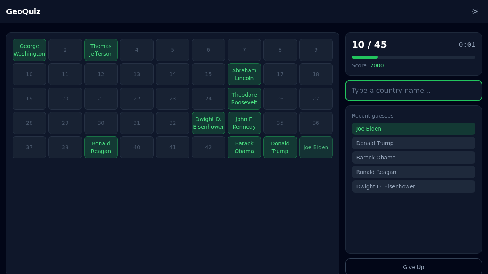

# GeoQuiz

A free, ad-free geography quiz game. Type country names, capitals, or presidents — answers match instantly as you type (no Enter key needed). Inspired by Sporcle.


## Quiz Types

### Map Quizzes

Type a country or state name and watch it light up on the SVG map. Labels appear at pre-computed centroids.


### Tabular Quizzes

For quizzes without maps (presidents, member states, etc.), a numbered grid reveals entries as you guess them.



## Quizzes

**19 quizzes** across 6 categories:

| Category | Quizzes |
|----------|---------|
| Continents | Europe, Africa, Asia, North America, South America, Oceania |
| Capitals | Europe, Africa, Asia, North America, South America |
| United States | US States, US State Capitals |
| Regional | EU Members, NATO Members, Middle East, Southeast Asia |
| History | US Presidents |
| Trivia | World's Largest Countries |

## Setup

Requires Python 3.13+ and [uv](https://docs.astral.sh/uv/).

```bash
git clone https://github.com/EvanOman/geoquiz.git
cd geoquiz
uv sync
just dev  # starts on port 9100
```

## Development

```bash
just dev          # dev server with hot reload
just test         # run tests
just lint         # check formatting and lint
just fix          # auto-fix lint issues
```

## How It Works

- **Backend:** FastAPI + Jinja2 templates + uvicorn
- **Frontend:** Tailwind CSS (CDN) + vanilla JavaScript — no build step
- **Maps:** Inline SVGs with ISO-coded element IDs, highlighted via CSS classes
- **Data:** Python dataclasses — no database
- **Answer matching:** Input is normalized (lowercase, strip diacritics/articles/punctuation) and checked against a pre-built `Map` on every keystroke for instant O(1) matching

## Scripts

```bash
# Re-compute SVG label centroids after modifying maps
uv run python scripts/compute_centroids.py
```

## License

MIT
